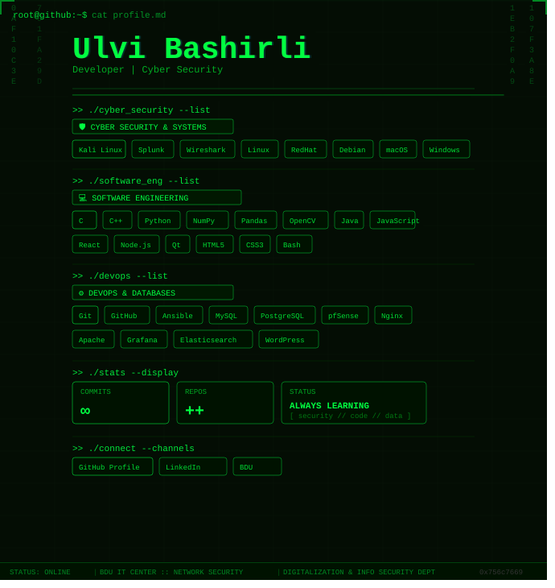

<div align="center">

<!-- SVG Banner -->


<br/><br/>

```
root@github:~$ whoami
> Ulvi Bashirli — Developer | Cyber Security
```

<br/>

---

### 🛡️ Cyber Security & Systems


---

### 💻 Software Engineering


---

### ⚙️ DevOps & Databases


---


<!-- 
&nbsp;
 -->

<!-- <br/><br/> -->

<!--  -->

---

### 🌐 Connect

[](https://linkedin.com/in/bashsecurity)
[](mailto:bashprotechnologies@gmail.com)

<br/>

```
> Connection established. All systems operational.
> Press any key to continue... █
```

</div>
